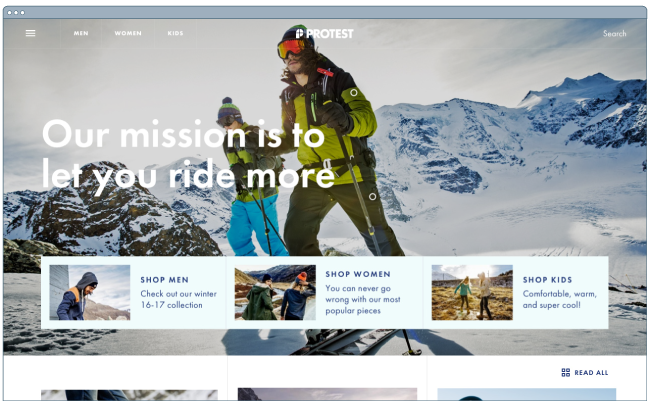
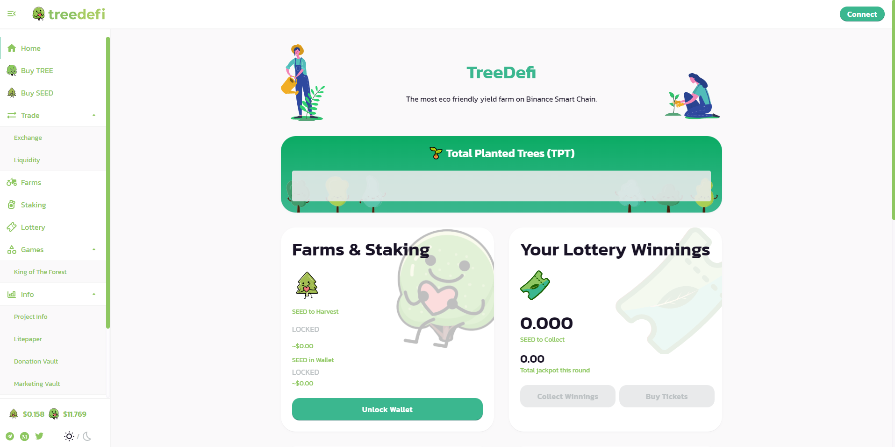
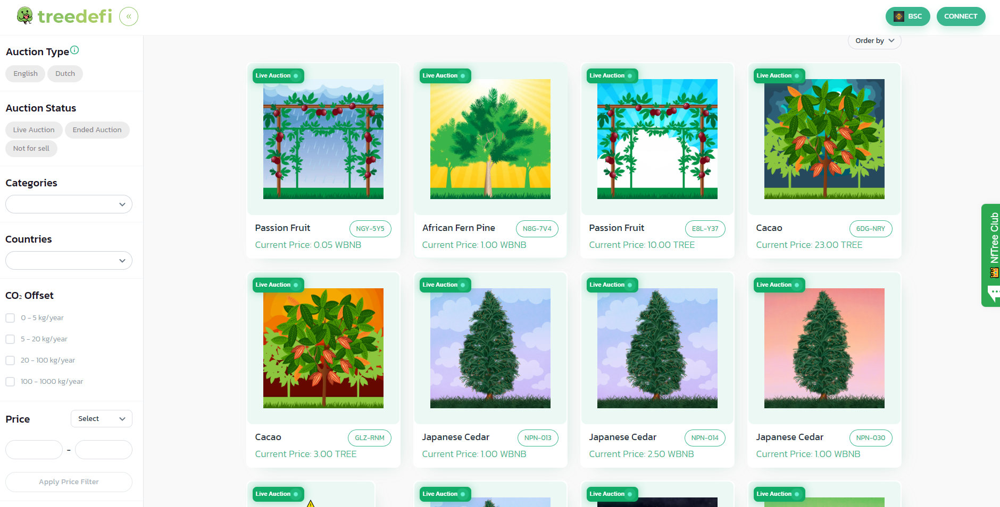
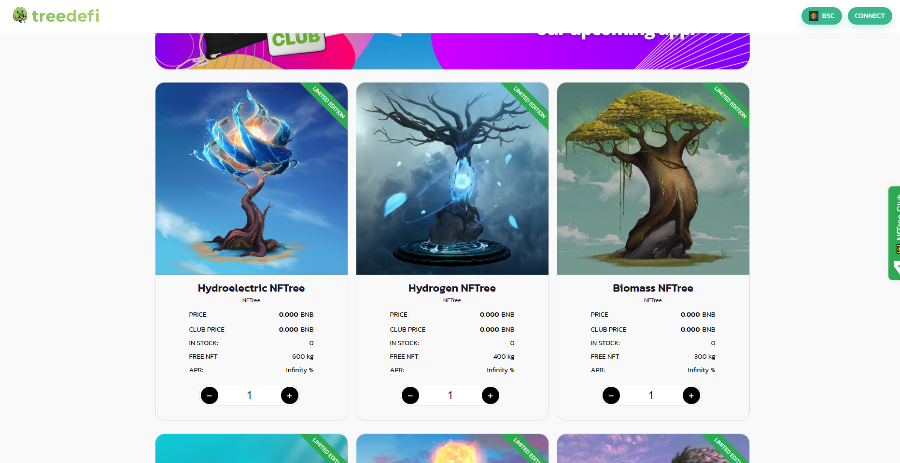

 <meta name="awesome-portfolio"/>
<meta title="awesome-portfolio"/>
<meta description="awesome-portfolio"/>

<meta name="portfolio"/>
<meta name="github"/>
<meta name="full-stack"/>

  

### :woman_technologist: &nbsp;About Me :

I am full stack engineer who majors in Laravel, Vue, React, Node.js and flutter.  

- ⚡ I am currently working remotely.
- 🔭 I’m working as a Software Engineer and contributing to frontend and backend for building web and mobile app applications.
- 🌱 Exploring Technical Content Writing.

<h2 align="left" id="macropower-tech">Favorite Tech</h2>

> 

Programming languages.

  
    
    
    
    
    
    
    
    
    
    

> Frameworks and libraries.

    
    
    
    
    
    
    
    
    
    

> Databases and cloud hosting.

    
    
    
    
    
    
    
    

> Software and tools.

    
    
    
    
    
    
    
    
    

 

#### Laravel website
##### [Online-Shopping](http://www.mikiyakobayashi.com/)

  

#### Frontend Design with react.js(NFT Marketplaces) 
##### [Pocoland](https://pocoland.com/nft-market)

#### Laravel+React.js 
##### [Online-shopping(clothes)](https://www.protest.eu/)

  

#### Frontend Design(Defi, NFT Staking, NFT Marketplace)
 

  <a href='https://dex.treedefi.com/' target='_blank'>
  </img>
  </a>
  <a href='https://nft.treedefi.com/' target='_blank'>
  </img>
  </a>
  <a href='https://nft.treedefi.com/merchandise' target='_blank'>
  </img>
  </a>

